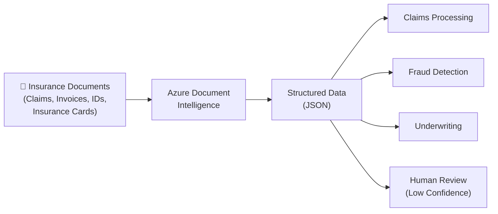

# Azure Document Intelligence — Insurance Quickstart

A bite-sized, hands-on introduction to **Azure Document Intelligence** (formerly Form Recognizer) for insurance companies. Each notebook covers one feature with a real-world insurance scenario, ready to run in minutes.

> **SDK Version**: `azure-ai-documentintelligence==1.0.2` · **API**: v4.0 GA (2024-11-30) · **Language**: Python 3.8+

---

## What Is Azure Document Intelligence?

Azure Document Intelligence is a cloud-based AI service (part of **Azure AI Foundry Tools**) that uses machine learning to extract text, key-value pairs, tables, and structures from documents — automatically and accurately.



### Why Document Intelligence for Insurance?

| Benefit | Description |
|---|---|
| **Accelerate Claims Processing** | Extract data from claim forms, invoices, and receipts in seconds instead of hours |
| **Reduce Manual Data Entry** | Eliminate error-prone manual transcription of policy documents |
| **Automate KYC/Identity Verification** | Extract and verify policyholder identity from IDs and passports |
| **Health Insurance Card Processing** | Instantly read member IDs, group numbers, and plan details |
| **Custom Document Support** | Train models on your proprietary claim forms and policy documents |
| **Confidence-Based Review** | Route low-confidence extractions to human reviewers automatically |
| **Regulatory Compliance** | Built-in security, encryption, and 100+ compliance certifications |

---

## Key Features at a Glance

| Feature | Model ID | Insurance Use Case |
|---|---|---|
| **Read** | `prebuilt-read` | Extract text from scanned claim letters |
| **Layout** | `prebuilt-layout` | Parse tables from policy schedules |
| **Invoice** | `prebuilt-invoice` | Process repair/medical invoices |
| **Receipt** | `prebuilt-receipt` | Validate expense receipts on claims |
| **ID Document** | `prebuilt-idDocument` | KYC: verify policyholder identity |
| **Health Insurance Card** | `prebuilt-healthInsuranceCard.us` | Onboard members, verify coverage |
| **Contract** | `prebuilt-contract` | Extract agreement and party details |
| **Custom Neural Model** | `{your-model-id}` | Proprietary claim form extraction |
| **Custom Classifier** | `{your-classifier-id}` | Auto-sort incoming mail by document type |

---

## Repository Structure

```
document-intelligence-quickstart/
├── README.md                              ← You are here
├── requirements.txt                       ← Python dependencies
├── .env.example                           ← Credential template
│
├── notebooks/
│   ├── 00-setup-and-basics.ipynb          ← Start here: auth & first API call
│   ├── 01-read-model.ipynb               ← Extract text from scanned claims
│   ├── 02-layout-model.ipynb             ← Extract tables & structure
│   ├── 03-prebuilt-invoice.ipynb         ← Process invoices
│   ├── 04-prebuilt-receipt.ipynb         ← Validate expense receipts
│   ├── 05-prebuilt-id-document.ipynb     ← KYC identity verification
│   ├── 06-prebuilt-insurance-card.ipynb  ← Health insurance card extraction
│   ├── 07-custom-model.ipynb            ← Train on your claim forms
│   ├── 08-document-classifier.ipynb     ← Classify incoming documents
│   ├── 09-addon-capabilities.ipynb      ← Barcodes, query fields, high-res
│   ├── 10-human-in-the-loop.ipynb       ← Confidence-based review workflow
│   └── 11-batch-processing.ipynb        ← Process documents at scale
│
├── sample-documents/
│   └── README.md                         ← Sample document links & guidance
│
└── docs/
  ├── performance-scalability-observability.md ← Performance, scale, security, and observability guide
    ├── security-privacy-compliance.md    ← Encryption, HIPAA, compliance
    ├── resilience-and-dr.md             ← Disaster recovery & high availability
    ├── data-residency.md                ← Regional data processing guarantees
    └── resources.md                     ← SDK docs, samples, learning paths
```

---

## Quick Start (5 Minutes)

### 1. Prerequisites

- **Python 3.8+** installed ([download](https://www.python.org/downloads/))
- **Azure subscription** ([create free](https://azure.microsoft.com/pricing/purchase-options/azure-account))
- **Document Intelligence resource** — create one in the [Azure Portal](https://portal.azure.com/#create/Microsoft.CognitiveServicesFormRecognizer)
  - Use **Free tier (F0)** to get started (500 free pages/month)

### 2. Clone and Set Up

```bash
git clone <this-repo-url>
cd document-intelligence-quickstart

# Create virtual environment
python -m venv .venv
source .venv/bin/activate  # Linux/macOS
# .venv\Scripts\activate   # Windows

# Install dependencies
pip install -r requirements.txt
```

### 3. Configure Credentials

```bash
cp .env.example .env
# Edit .env with your endpoint and API key from the Azure Portal
```

Find your credentials in the Azure Portal:
**Document Intelligence resource → Keys and Endpoint**

### 4. Launch Notebooks

```bash
jupyter notebook notebooks/
```

Start with **[00-setup-and-basics.ipynb](notebooks/00-setup-and-basics.ipynb)** to verify your connection, then explore any notebook that matches your use case.

---

## Notebooks Overview

### Getting Started
| # | Notebook | Description | Time |
|---|---|---|---|
| 00 | [Setup & Basics](notebooks/00-setup-and-basics.ipynb) | Authentication, client setup, first API call | 5 min |

### Prebuilt Models (No Training Required)
| # | Notebook | Insurance Scenario | Time |
|---|---|---|---|
| 01 | [Read Model](notebooks/01-read-model.ipynb) | Extract text from scanned claim letters and handwritten notes | 5 min |
| 02 | [Layout Model](notebooks/02-layout-model.ipynb) | Extract tables and structure from policy schedule documents | 10 min |
| 03 | [Prebuilt Invoice](notebooks/03-prebuilt-invoice.ipynb) | Process repair shop and medical invoices for claim reimbursement | 10 min |
| 04 | [Prebuilt Receipt](notebooks/04-prebuilt-receipt.ipynb) | Validate expense receipts attached to insurance claims | 5 min |
| 05 | [Prebuilt ID Document](notebooks/05-prebuilt-id-document.ipynb) | KYC verification — extract data from driver's licenses and passports | 5 min |
| 06 | [Health Insurance Card](notebooks/06-prebuilt-insurance-card.ipynb) | Onboard new members by reading insurance card details | 5 min |

### Custom Models (Train on Your Data)
| # | Notebook | Insurance Scenario | Time |
|---|---|---|---|
| 07 | [Custom Model](notebooks/07-custom-model.ipynb) | Train a model on proprietary claim forms | 15 min |
| 08 | [Document Classifier](notebooks/08-document-classifier.ipynb) | Auto-classify incoming mail (claim vs. invoice vs. ID) | 15 min |

### Advanced Topics
| # | Notebook | Insurance Scenario | Time |
|---|---|---|---|
| 09 | [Add-on Capabilities](notebooks/09-addon-capabilities.ipynb) | Barcodes on claim forms, query fields, high-res for faded faxes | 10 min |
| 10 | [Human-in-the-Loop](notebooks/10-human-in-the-loop.ipynb) | Confidence-based review queue with correction workflow | 15 min |
| 11 | [Batch Processing](notebooks/11-batch-processing.ipynb) | Process a folder of claim documents at scale | 10 min |

---

## Security, Privacy & Compliance

Azure Document Intelligence is designed with enterprise-grade security built in — critical for insurance companies handling sensitive personal and medical data.

| Area | Details |
|---|---|
| **Encryption in Transit** | All API calls use HTTPS with TLS 1.3 |
| **Encryption at Rest** | Data encrypted using Azure-managed keys (AES-256). Customer-managed keys (CMK) supported |
| **Data Retention** | Analysis results auto-deleted after 24 hours. Immediate deletion available via [Delete Analyze Result API](https://learn.microsoft.com/en-us/rest/api/aiservices/document-models/delete-analyze-result) |
| **Authentication** | API keys or Microsoft Entra ID (Azure AD) with RBAC |
| **Data Residency** | Data processed and stored in the same region as your resource |
| **Compliance** | 100+ certifications including SOC 1/2/3, ISO 27001, HIPAA BAA, FedRAMP, PCI DSS |
| **Network Security** | Virtual network support, private endpoints, IP firewall rules |

> 📖 Deep-dive: [Security, Privacy & Compliance](docs/security-privacy-compliance.md) · [Data Residency](docs/data-residency.md) · [Resilience & DR](docs/resilience-and-dr.md) · [Performance, Scalability & Observability](docs/performance-scalability-observability.md)

---

## Resilience & High Availability

| Capability | Description |
|---|---|
| **Cross-Region Model Copy** | Replicate custom models to a secondary region using the [Copy API](https://learn.microsoft.com/en-us/azure/ai-services/document-intelligence/disaster-recovery) |
| **Multi-Region Deployment** | Deploy resources in multiple regions for active-active or active-passive failover |
| **Service Quotas** | 15 TPS default (adjustable via support request), up to 2,000 pages per document |
| **Retry & Backoff** | Built-in SDK retry policies with exponential backoff |

> 📖 Deep-dive: [Resilience & Disaster Recovery](docs/resilience-and-dr.md)

For an operations-focused production playbook covering performance tuning, scale patterns, resiliency controls, security controls, and observability setup, see [Performance, Scalability & Observability](docs/performance-scalability-observability.md).

---

## Resources & Further Reading

### Official Documentation
- [Azure Document Intelligence Overview](https://learn.microsoft.com/en-us/azure/ai-services/document-intelligence/overview?view=doc-intel-4.0.0)
- [Python SDK Reference](https://learn.microsoft.com/en-us/python/api/overview/azure/ai-documentintelligence-readme?view=azure-python)
- [REST API Reference](https://learn.microsoft.com/en-us/rest/api/aiservices/operation-groups?view=rest-aiservices-v4.0%20(2024-11-30))

### SDKs & Packages
- [PyPI: azure-ai-documentintelligence](https://pypi.org/project/azure-ai-documentintelligence/1.0.2/)
- [GitHub: Azure SDK for Python](https://github.com/Azure/azure-sdk-for-python/tree/main/sdk/documentintelligence/azure-ai-documentintelligence)
- [GitHub: azure-docs-sdk-python](https://github.com/MicrosoftDocs/azure-docs-sdk-python)

### Interactive Tools
- [Document Intelligence Studio](https://documentintelligence.ai.azure.com/studio) — try models in the browser with no code
- [Azure Portal](https://portal.azure.com/#create/Microsoft.CognitiveServicesFormRecognizer) — create a resource

### Samples & Learning
- [Python SDK Samples on GitHub](https://github.com/Azure/azure-sdk-for-python/tree/main/sdk/documentintelligence/azure-ai-documentintelligence/samples)
- [Document Intelligence Code Samples](https://github.com/Azure-Samples/document-intelligence-code-samples)
- [MS Learn: Use Prebuilt Document Intelligence Models](https://learn.microsoft.com/en-us/training/modules/use-prebuilt-form-recognizer-models/)
- [MS Learn: Extract Data from Forms](https://learn.microsoft.com/en-us/training/modules/work-form-recognizer/)

### Pricing
- [Document Intelligence Pricing](https://azure.microsoft.com/pricing/details/ai-document-intelligence/)
- **Free tier (F0)**: 500 pages/month, 2 pages max per document
- **Standard tier (S0)**: Pay-per-page, 2,000 pages max per document, adjustable TPS

> 📖 Full curated list: [Resources & Links](docs/resources.md)

---

## License

This quickstart repository is provided as-is for educational purposes. See [LICENSE](LICENSE) for details.

The Azure Document Intelligence service is subject to [Microsoft Azure Terms of Service](https://azure.microsoft.com/support/legal/) and [Azure AI Services Terms](https://www.microsoft.com/licensing/terms).
